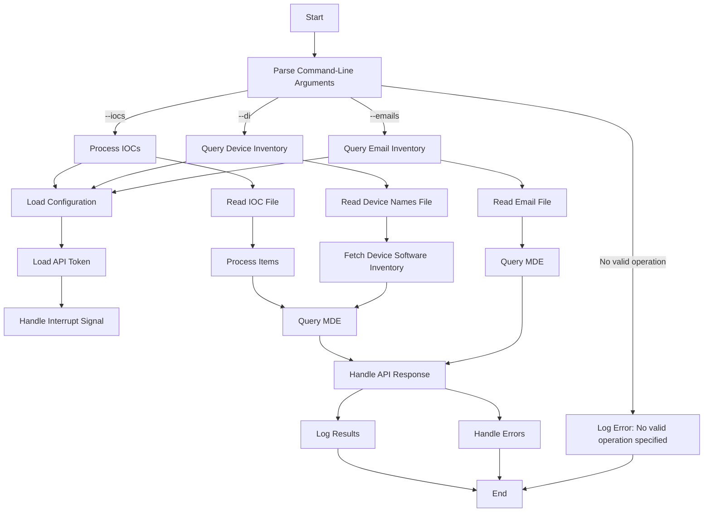

Here’s the updated README based on the new code modifications:

# MDE Lazy Hunter

## Overview

The **MDE Lazy Hunter** script interacts with the Microsoft Defender for Endpoint (MDE) API to query various types of data. It supports six input types: SHA256, SHA1, MD5 hashes, public IPv4 addresses, private IPv4 addresses, URLs, and hostnames. Results are processed asynchronously, timestamps are converted to Cairo time, and results are saved in a CSV file. The script also includes robust error handling and user prompts to decide whether to continue processing after an error or interruption.

## Features

- **MDE Querying**: Queries the Microsoft Defender for Endpoint API using KQL (Kusto Query Language) queries.
- **Timestamp Conversion**: Converts UTC timestamps to Cairo local time.
- **Input Validation**: Validates SHA256, SHA1, MD5, IPv4 addresses, URLs, and hostnames.
- **Asynchronous Processing**: Utilizes asynchronous processing to handle multiple queries concurrently.
- **Rate Limiting**: Adheres to API rate limits of up to 45 calls per minute and 1,500 calls per hour.
- **CSV Output**: Saves query results to a CSV file in the `results` folder.
- **User Interrupt Handling**: Prompts the user to decide whether to continue or exit when an error occurs or when interrupted.
- **Device Inventory Querying**: Query and export software inventory information for specified devices.
- **Email Querying**: Queries device events based on email addresses.
- **Robust Error Handling**: Custom exception classes for different API error scenarios.
- **Flexible Input Processing**: Support for both IOC processing and device inventory queries.
- **Windows Compatibility**: Special event loop policy for Windows systems.

## Prerequisites

- Python 3.7 or higher
- Required libraries: `aiohttp`, `dateutil`, `pytz`, `aiofiles`, `argparse`

Install the required libraries using:

```bash
pip install aiofiles aiohttp python-dateutil pytz argparse
```

## Obtaining the API Key


To obtain the API key required for the script:

1. Visit the [Microsoft Defender API Explorer](https://security.microsoft.com/interoperability/api-explorer).
2. Open the Network inspection tool in your browser (e.g., press F12 and navigate to the "Network" tab).
3. Run a query test in the API Explorer.
4. Find the request made, search for 'token' by the API Explorer, and locate the authorization header.
5. Copy the API key (excluding the "Bearer" prefix) and add it to the `config.json` file.

## Configuration

Create a `config.json` file with the following format:

```json
{
    "api_token": "YOUR_API_KEY"
}
```

## Script Usage

The script supports three main operations:

1. **IOC Processing**:
```bash
python mdelh.py --iocs path/to/IOCs.txt
```

2. **Device Inventory Query**:
```bash
python mdelh.py --di path/to/device_names.txt
```

3. **Email Inventory Query**:
```bash
python mdelh.py --emails path/to/emails.txt
```

## Functions

- `convert_to_cairo_time(timestamp_str)`: 
  Converts a UTC timestamp to Cairo local time.

- `is_sha256(value)`: 
  Validates if a given string is a valid SHA256 hash.

- `is_sha1(value)`: 
  Validates if a given string is a valid SHA1 hash.

- `is_md5(value)`: 
  Validates if a given string is a valid MD5 hash.

- `is_ipv4(value)`: 
  Validates if a given string is a valid public IPv4 address.

- `is_private_ipv4(value)`: 
  Validates if a given string is a valid private IPv4 address.

- `is_url(value)`: 
  Validates if a given string is a valid URL.

- `is_hostname(value)`: 
  Validates if a given string is a valid hostname.

- `query_mde(session, api_token, query)`: 
  Queries the MDE API with the provided query and returns the JSON response.

- `process_items(items, api_token)`: 
  Processes a list of items asynchronously, queries the MDE API for each item, and writes the results to a CSV file.

- `fetch_device_software_inventory(api_token, device_inv)`: 
  Queries the device software inventory for a specific device.

- `query_device_inventory(api_token, device_names_file)`: 
  Processes a list of device names and retrieves their software inventory.

- `query_email_inventory(api_token, emails_file)`: 
  Queries the MDE API for device events based on email addresses.

## Example

**Prepare Input File**: Create a file named `IOCs.txt` with content like:

```
0ab2ff188e8e6d624b60f6c164c4759a09079fe5
43b9bc43eee4c0e034ec44d5ca8188d015dc473c2e535e89e3d1c3e7541b11af
7fae200181be69d91051efc570b665ac
192.168.1.1
google.com
https://bing.com
```

**Run the Script**:

```bash
python mdelh.py --iocs IOCs.txt
```

**Expected Output**: Results are saved in `results/results.csv` with timestamps converted to Cairo time.

## Logging and Error Handling

- The script logs errors encountered during API queries or result processing using Python’s logging module.
- If a critical error occurs, the script stops processing further items and logs the issue.
- The user is prompted to decide whether to continue processing or exit when an error occurs or when the script is interrupted.

## Rate Limits

The script adheres to these API rate limits:

- **45 calls per minute**: Automatically pauses if this limit is reached within a minute.
- **1,500 calls per hour**: Automatically pauses if this limit is reached within an hour.

## Notes

- Ensure the API token has the necessary permissions to query the MDE API.
- The script is intended for educational purposes. Use it responsibly when handling sensitive data.

## Future Updates

- **Enhanced CSV Output**: Add more fields and data validation to the CSV output.
- **Improved Logging**: Expand logging for better traceability and debugging.

## Limitations

- **Query Timeframe**: Queries can only be run on data from the last 30 days.
- **Result Size**: Maximum of 100,000 rows per query.
- **Execution Limits**:
  - **API Calls**: Up to 45 calls per minute, 1,500 calls per hour.
  - **Execution Time**: Up to 10 minutes of running time per hour and 3 hours per day.
  - **Max Request Duration**: 10 minutes.

## Code Flow in Mermaid 


## Updates and Tasks

### To Do
- [x] Update documentation for new features
- [ ] Implement unit tests for the new module
- [ ] Review pull requests
- [ ] Optimize performance for data processing

### In Progress
- [x] Refactor code for better readability
- [ ] Add new logging features

### Completed
- [x] Add device inventory function
- [x] Add email querying feature

## Output Files

The script generates different output files based on the operation:

1. **IOC Processing**: Results are saved in `results/results.csv`
2. **Device Inventory**: Results are saved in `results/device_inventory_results.csv` with the following fields:
   - DeviceId
   - DeviceName
   - SoftwareName
   - SoftwareVersion
   - OSPlatform
   - OSVersion
3. **Email Inventory**: Results are saved in `results/email_results.csv` with the following fields:
   - Email
   - DeviceId
   - DeviceName

## Custom Exceptions

The script now includes custom exceptions for better error handling:

- `APIUnauthorizedError`: Invalid or expired API token
- `APIForbiddenError`: Access forbidden (403)
- `APINotFoundError`: Resource not found (404)
- `APIServerError`: Server-side errors (500+)
- `APIError`: Other API-related errors
