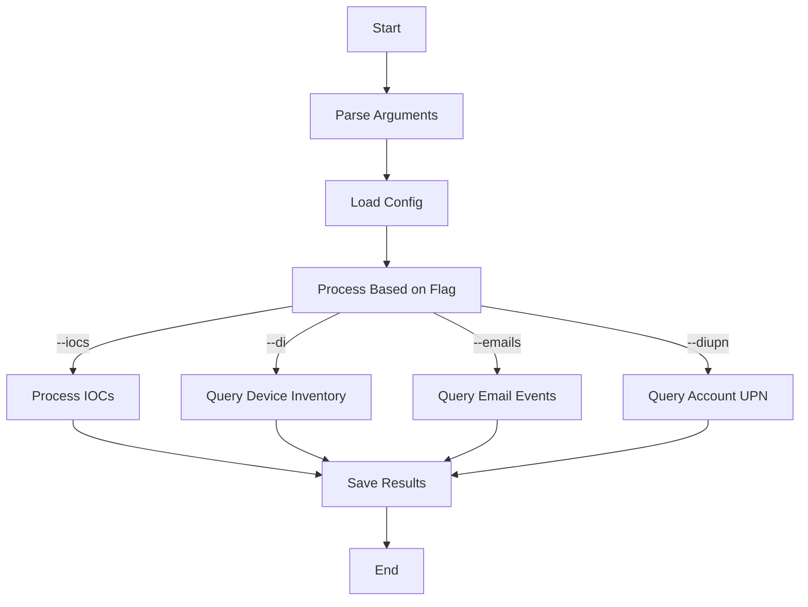

# MDE Lazy Hunter

```
███╗   ███╗██████╗ ███████╗██      ██╗  ██╗
████╗ ████║██╔══██╗██╔════╝██║     ██║  ██║
██╔████╔██║██║  ██║█████╗  ██║     ███████║
██║╚██╔╝██║██║  ██║██╔══╝  ██║     ██╔══██║
██║ ╚═╝ ██║██████╔╝███████╗███████╗██║  ██║
╚═╝     ╚═╝╚═════╚══════╝╚════╝╚═╝ ╚═╝  ╚═╝
```

**Version**: 1.0.1  
**Author**: Aly Emara

## Overview

The **MDE Lazy Hunter** script interacts with the Microsoft Defender for Endpoint (MDE) API to query various types of data. It supports multiple query types including IOCs, device inventory, and email-based queries. Results are processed asynchronously with built-in rate limiting and graceful error handling.

## Features

- **Multiple Query Types**:
  - IOC Processing (SHA256, SHA1, MD5, IPs, URLs)
  - Device Software Inventory
  - Account UPN from Device Names
  - Email-based Device Events
- **Advanced Processing**:
  - Asynchronous API calls
  - Automatic rate limiting
  - Cairo timezone conversion
  - Graceful interrupt handling
- **Robust Error Handling**:
  - Custom exceptions for different API responses
  - Two-stage interrupt handling (Ctrl+C)
  - Automatic retries for failed queries

## Prerequisites

- Python 3.7 or higher
- Required libraries:
```bash
pip install aiohttp python-dateutil pytz aiofiles argparse
```

## Command Line Usage

```bash
# Process IOCs
python mdelh.py --iocs path/to/IOCs.txt

# Query device inventory
python mdelh.py --di path/to/device_names.txt

# Query email-based events
python mdelh.py --emails path/to/emails.txt

# Query Account UPN from device names
python mdelh.py --diupn path/to/device_names.txt

# Update API key
python mdelh.py --config <API-Key>
```

## Configuration

Create `config.json`:
```json
{
    "api_token": "YOUR_API_KEY"
}
```

## Output Files

Results are saved in the `results` directory:
- `results.csv` - IOC query results
- `device_inventory_results.csv` - Device inventory data
- `email_results.csv` - Email-based query results
- `account_upn_results.csv` - Device UPN mapping results

## Rate Limits & Error Handling

- **Rate Limits**:
  - 45 calls per minute
  - 1,500 calls per hour
  - Automatic handling of 429 responses
- **Error Handling**:
  - Custom exceptions for API errors
  - Graceful shutdown on interrupts
  - Automatic retries with exponential backoff

## New Features in 1.0.1

- Added Account UPN querying
- Improved rate limit handling
- Two-stage interrupt handling
- Enhanced error logging
- Windows compatibility improvements

## Code Flow


## Limitations

- 30-day query timeframe limit
- 100,000 rows per query maximum
- 124 MB result size limit per request
- Rate limits enforced by API

## Error Codes

- 401: Invalid/expired API token
- 403: Access forbidden
- 429: Rate limit exceeded
- 500+: Server errors

For more details, visit the [Microsoft Defender API Documentation](https://learn.microsoft.com/en-us/defender-endpoint/api/exposed-apis-list)
